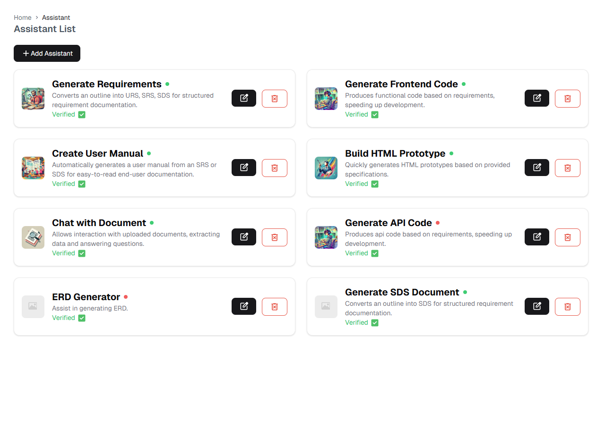
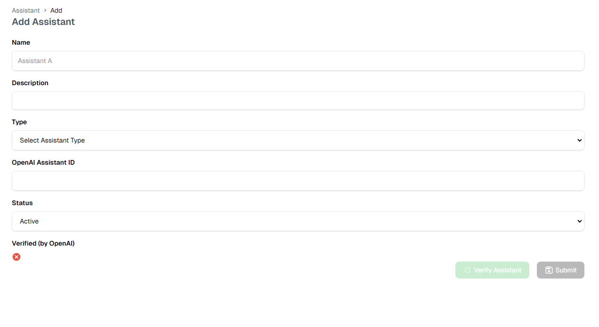
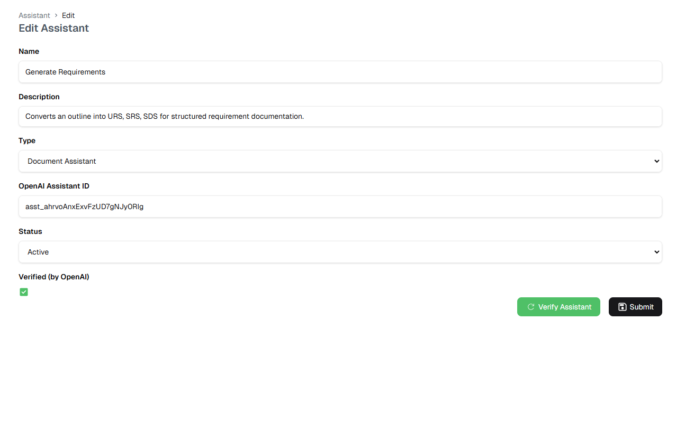
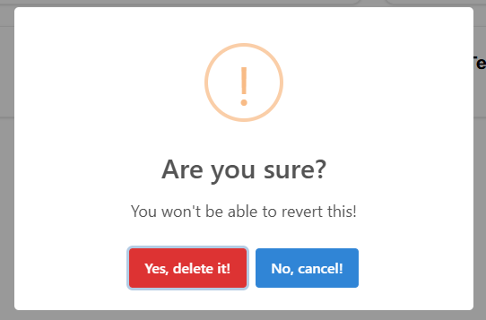

# AI Assistants

::: tip Overview
Manage your AI assistants through a centralized interface. View, add, edit, and configure assistants for different development tasks.
:::

## Assistant Dashboard

  

    <h4>📋 Generate Requirements</h4>
    <ul>
      <li>Creates URS, SRS, SDS documentation</li>
      <li>OpenAI Verified ✓</li>
      <li>Status: Active</li>
    </ul>
  

  

    <h4>💻 Generate Frontend Code</h4>
    <ul>
      <li>Produces code from requirements</li>
      <li>OpenAI Verified ✓</li>
      <li>Status: Active</li>
    </ul>
  

  

    <h4>📚 Create User Manual</h4>
    <ul>
      <li>Generates manuals from SRS/SDS</li>
      <li>OpenAI Verified ✓</li>
      <li>Status: Active</li>
    </ul>
  

  

    <h4>🎨 Build HTML Prototype</h4>
    <ul>
      <li>Creates HTML from specifications</li>
      <li>OpenAI Verified ✓</li>
      <li>Status: Active</li>
    </ul>
  

  

    <h4>💬 Chat with Document</h4>
    <ul>
      <li>Document interaction & analysis</li>
      <li>OpenAI Verified ✓</li>
      <li>Status: Active</li>
    </ul>
  

  

    <h4>📄 Generate SDS Document</h4>
    <ul>
      <li>Creates structured SDS docs</li>
      <li>OpenAI Verified ✓</li>
      <li>Status: Active</li>
    </ul>
  

## Managing Assistants

### Adding New Assistant

Required fields for new assistant:
1. **Name** - Assistant identifier
2. **Description** - Purpose and capabilities
3. **Type** - Assistant category
4. **OpenAI Assistant ID** - Integration ID
5. **Status** - Active/Inactive setting

### Editing Assistant

Editable properties:
- Assistant name
- Description
- Assistant type
- OpenAI configuration
- Status settings

### Removing Assistant

Deletion process:
1. Click delete button
2. Confirm deletion in dialog
3. Assistant and data removed

::: warning Important Notes
- Verify OpenAI integration before activation
- Deletion cannot be undone
- Keep assistant IDs secure
:::

For more information about using assistants, visit the [Platform Overview](./platform-overview.md) section. 