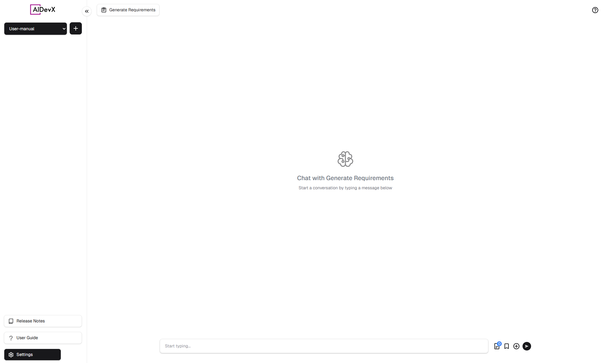
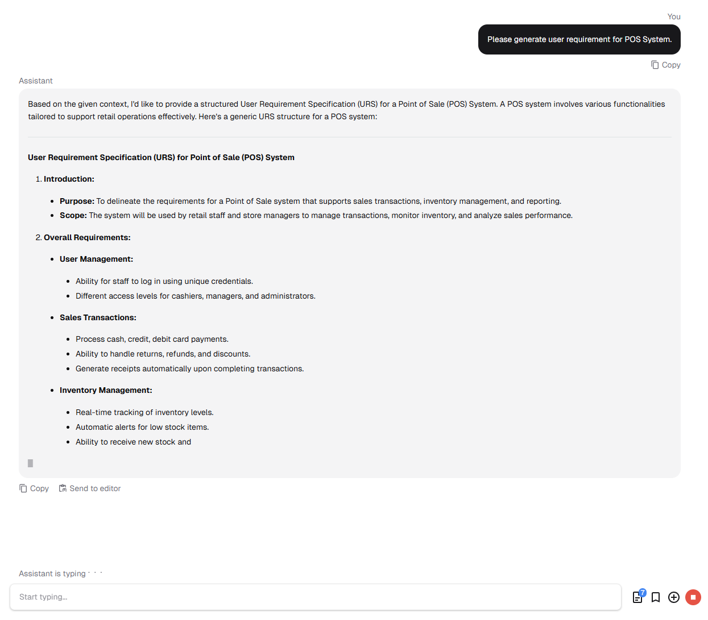
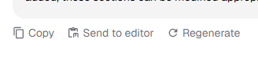
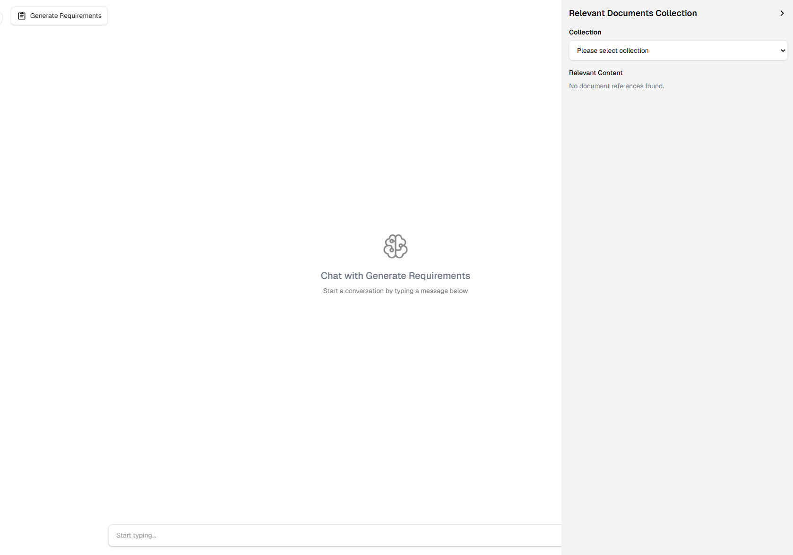
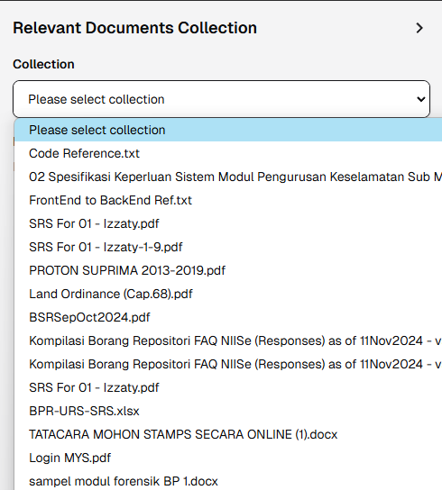
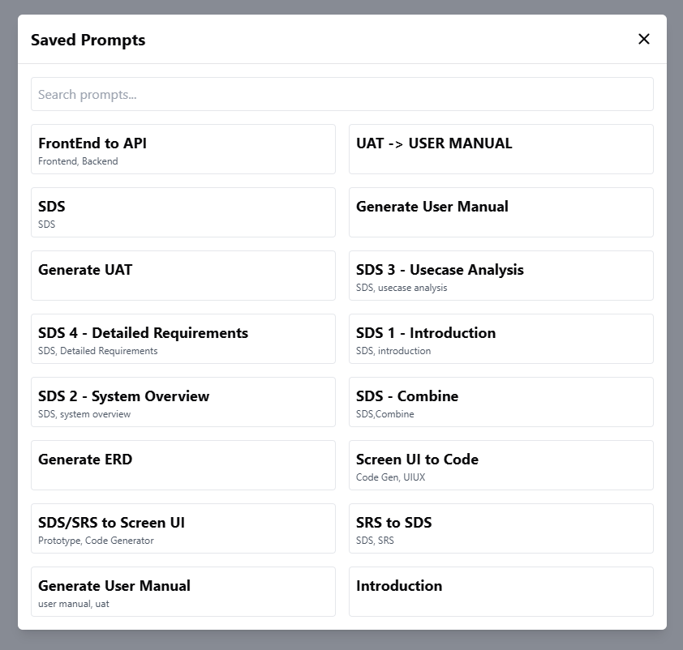
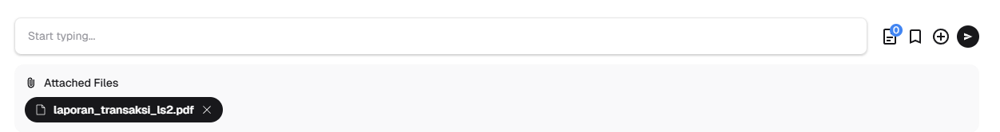
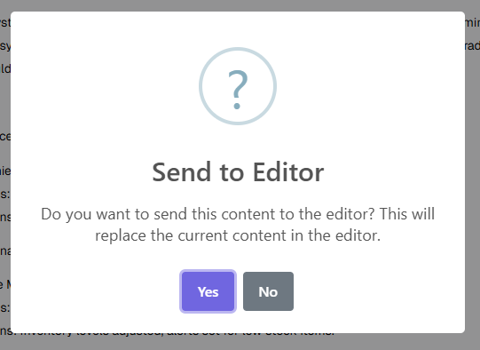
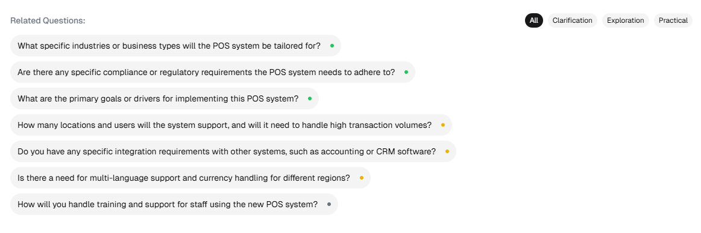

# Chat Interface Guide

::: tip Quick Overview
The Chat Interface provides a straightforward way to interact with AI assistants, featuring message streaming, document references, and essential tools.
:::

## Interface Overview 🖥️

  

    <h4>💬 Chat Area</h4>
    <ul>
      <li>View conversation history</li>
      <li>Real-time message streaming</li>
      <li>Message options</li>
    </ul>
  

  

    <h4>⌨️ Input Section</h4>
    <ul>
      <li>Message input field</li>
      <li>Send button</li>
      <li>File attachment option</li>
    </ul>
  

  

    <h4>🛠️ Toolbar</h4>
    <ul>
      <li>Help menu</li>
      <li>Document references</li>
      <li>Saved prompts</li>
    </ul>
  

## Key Features

### 1. Message Interaction 💭

#### Sending Messages
1. Type your message in the input field
2. Click the send button or press Enter
3. Wait for the AI's response

#### Real-time Responses

During response generation:
- Text appears gradually as it's generated
- Typing indicator shows AI is working
- You can read the response as it's being created

#### Message Actions

Each completed message has three options:
- **Copy** - Copy message content
- **Send to Editor** - Transfer content to editor
- **Regenerate** - Get a new response

### 2. Essential Tools 🧰

#### Document References

The document icon shows:
- Blue counter for referenced documents
- Click to view document details

#### Document Sidebar

When you click the document icon:
1. A sidebar opens
2. View referenced document sections
3. See how documents relate to responses

#### Document Collections

Use the dropdown to:
1. Choose specific collections
2. Browse available documents
3. Filter relevant content

#### Saved Prompts

Access your saved prompts:
1. Click the bookmark icon
2. Search for specific prompts
3. Browse by category
4. Click a prompt to use it

#### File Attachments

To add files:
1. Click the attachment icon
2. Select files from your device
3. Manage attachments:
   - Remove files
   - Preview content
   - Add more files

### 3. Editor Integration ✏️

When using "Send to Editor":
1. A confirmation dialog appears
2. Choose to replace or keep existing content
3. Click "Yes" to proceed or "No" to cancel

### 4. Follow-up Questions

After each response:
1. System suggests related questions
2. Different question types available:
   - Clarification questions
   - Exploration topics
   - Implementation questions
3. Click any question to continue the conversation

## Best Practices 💡

::: tip For Best Results
- Wait for responses to complete before using message options
- Use follow-up questions to explore topics deeper
- Check document references for additional context
- Save important responses using the editor
- Attach relevant files when needed
:::

::: warning Important Notes
- Messages can't be copied while streaming
- Large files need more processing time
- Some file types may have size limits
- Keep your prompts clear and specific
:::

 