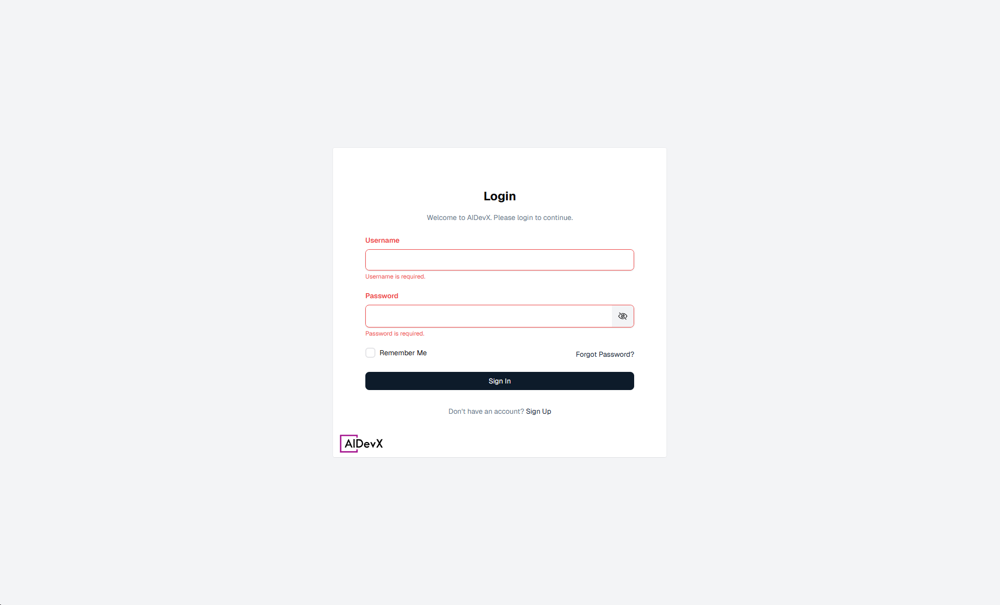

# Getting Started with AIDevX

Welcome to AIDevX, your advanced AI-powered platform for enhanced productivity and development workflows.

::: tip Quick Start
New to AIDevX? Follow these steps to get up and running in minutes:
1. [Access the Platform](#accessing-the-platform)
2. [Complete Initial Setup](#initial-setup)
3. [Explore Key Features](#key-features)
:::

## Accessing the Platform

To access the AIDevX platform:

1. Navigate to [AIDevX Platform](https://aidevx.mtssb.io)
2. Enter your credentials:
   - Username: `admin`
   - Password: `password`
3. Click the "Sign In" button to access the platform

::: warning Note
The platform is accessible only through internal credentials. Contact your system administrator if you experience any issues with access.
:::

## Initial Setup

After your first login, complete these steps to optimize your experience:

1. **Profile Setup**
   - Update your personal information
   - Set your preferences
   - Configure notification settings

2. **Workspace Configuration**
   - Choose your default project
   - Set up team access (if applicable)
   - Configure AI assistant preferences

3. **Tool Integration**
   - Connect your development environment
   - Set up version control access
   - Configure external tools

## Key Features

AIDevX offers several powerful features to enhance your workflow:

### 1. AI Assistants 🤖
- **Code Generation:** Get help writing and optimizing code
- **Documentation:** Automatically generate and maintain documentation
- **Analysis:** Receive intelligent code reviews and suggestions
[Learn more about AI Assistants →](/assistant-settings)

### 2. Chat Interface 💬
- **Natural Interaction:** Communicate with AI in natural language
- **Context Awareness:** AI understands your project context
- **Real-time Support:** Get immediate responses to your queries
[Explore Chat Interface →](/chat-interface)

### 3. Project Management 📊
- **Task Organization:** Manage your development tasks
- **Team Collaboration:** Work effectively with your team
- **Progress Tracking:** Monitor project status and milestones
[View Project Management →](/project-management)

### 4. Development Tools 🛠️
- **Markdown Editor:** Create and edit documentation
- **Document Templates:** Use pre-built templates
- **Repository System:** Organize your codebase
[Browse Tools →](/tools/markdown-editor)

## Next Steps

Ready to dive deeper? Here are some recommended next steps:

1. [Explore Platform Overview →](/platform-overview)
2. [Set Up Your First Project →](/project-management)
3. [Try AI Assistants →](/assistant-settings)

::: tip Need Help?
Check out our [Platform Overview](/platform-overview) for a comprehensive guide to all features, or contact support for assistance.
::: 