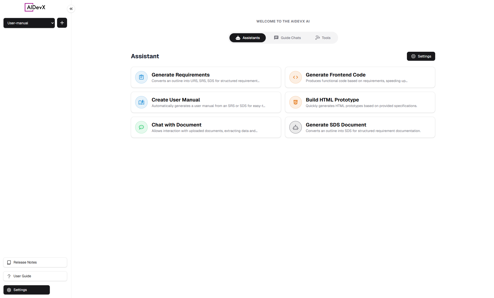
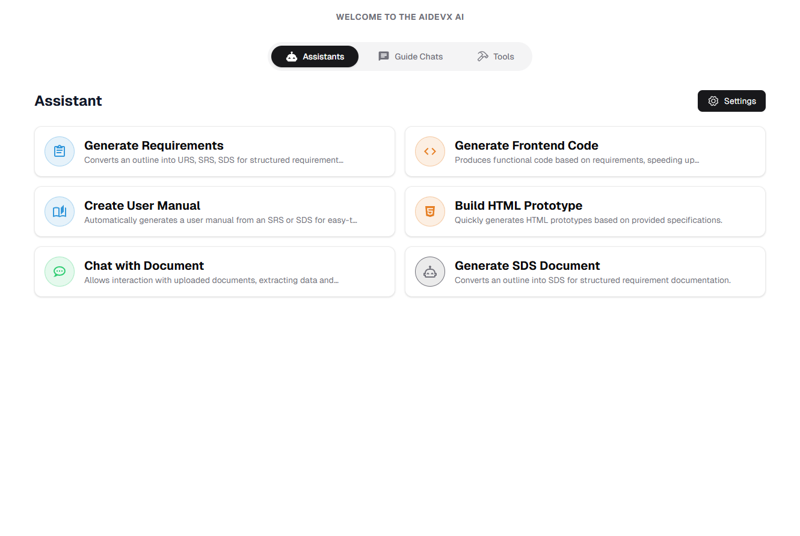
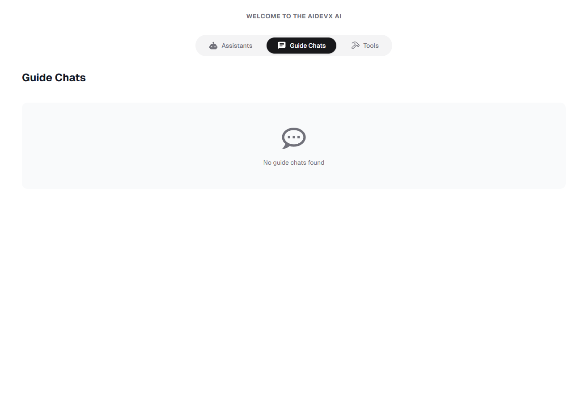
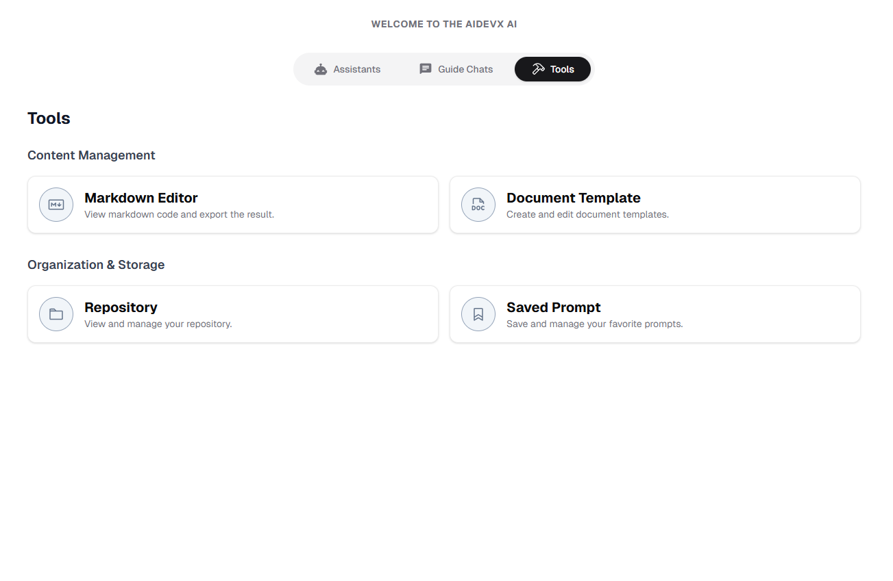

# Platform Overview

::: tip Platform at a Glance
AIDevX is an AI-powered development platform that combines intelligent assistants, structured workflows, and powerful tools to enhance your development process.
:::

## Dashboard Layout

The AIDevX platform is organized into three main areas:

| Section | Purpose | Key Features |
|---------|----------|--------------|
| 🎯 **Header Bar** | Navigation & Controls | Project selector, Settings, User profile |
| 📱 **Sidebar** | Quick Access | Favorites, Recent items, Navigation menu |
| 💻 **Main Content** | Work Area | Active tools, Chat interface, Content editor |

## Core Components

### 1. AI Assistants 🤖

Our specialized AI assistants help streamline your development workflow:

  

    <h4>📋 Requirements Generator</h4>
    <ul>
      <li>Convert outlines to URS/SRS/SDS</li>
      <li>Structured documentation</li>
      <li>Requirements validation</li>
    </ul>
    <a href="/assistant-settings#requirements">Learn More →</a>
  

  

    <h4>💻 Code Generator</h4>
    <ul>
      <li>Frontend code generation</li>
      <li>Component creation</li>
      <li>Style implementation</li>
    </ul>
    <a href="/assistant-settings#code">Learn More →</a>
  

  

    <h4>📚 Documentation Assistant</h4>
    <ul>
      <li>Auto-generate user manuals</li>
      <li>API documentation</li>
      <li>Code documentation</li>
    </ul>
    <a href="/assistant-settings#docs">Learn More →</a>
  

  

    <h4>🎨 Prototype Builder</h4>
    <ul>
      <li>HTML prototype generation</li>
      <li>Interactive mockups</li>
      <li>Design implementation</li>
    </ul>
    <a href="/assistant-settings#prototype">Learn More →</a>
  

### 2. Guide Chats 🗣️

Structured conversations for specific development tasks:

- **Pre-built Templates**
  - Requirements gathering
  - Code review
  - Bug analysis
  - Architecture planning

- **Custom Workflows**
  - Create custom templates
  - Define conversation flow
  - Set validation rules

::: info Coming Soon
New features being added to Guide Chats:
- Team collaboration templates
- Integration with project management
- Advanced workflow automation
:::

### 3. Development Tools 🛠️

#### Content Creation
- **Markdown Editor**
  - Real-time preview
  - Export options (PDF, HTML, DOCX)
  - Syntax highlighting
  [Open Editor →](/tools/markdown-editor)

- **Document Templates**
  - Pre-built templates
  - Custom template creation
  - Version control
  [Browse Templates →](/tools/document-template)

#### Project Organization
- **Repository System**
  - File management
  - Version tracking
  - Search functionality
  [Access Repository →](/tools/repository)

- **Prompt Library**
  - Save custom prompts
  - Organize by category
  - Quick access favorites
  [View Prompts →](/tools/saved-prompts)

## Workspace Configuration ⚙️

### Essential Settings

1. **Project Settings**
   - Team management
   - Integration setup
   - Security controls
   [Configure Project →](/settings#project-settings)

2. **User Preferences**
   - Interface customization
   - Notification settings
   - Language preferences
   [Update Preferences →](/settings)

3. **Workspace Setup**
   - Layout customization
   - Tool accessibility
   - Quick actions configuration
   [Customize Workspace →](/settings#workspace)

## Best Practices 💡

::: tip For Best Results
1. **Start Smart**
   - Choose the right assistant for your task
   - Use guide chats for complex workflows
   - Organize your repository from the beginning

2. **Stay Organized**
   - Use consistent naming conventions
   - Save frequently used prompts
   - Keep your repository structured

3. **Collaborate Effectively**
   - Share templates with team members
   - Use standardized workflows
   - Maintain documentation
:::

## Next Steps 🚀

Ready to dive deeper? Choose your path:

1. [Set Up Your First Project →](/project-management)
2. [Try AI Assistants →](/assistant-settings)

::: warning Remember
- Save your work regularly
- Keep your documentation up to date
- Use version control for important files
:::

 