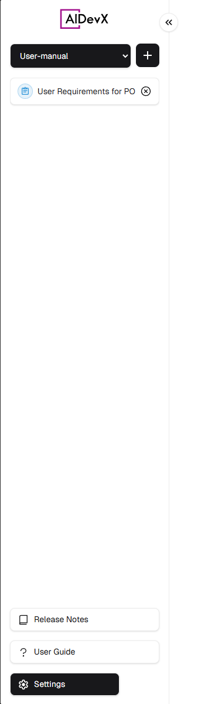
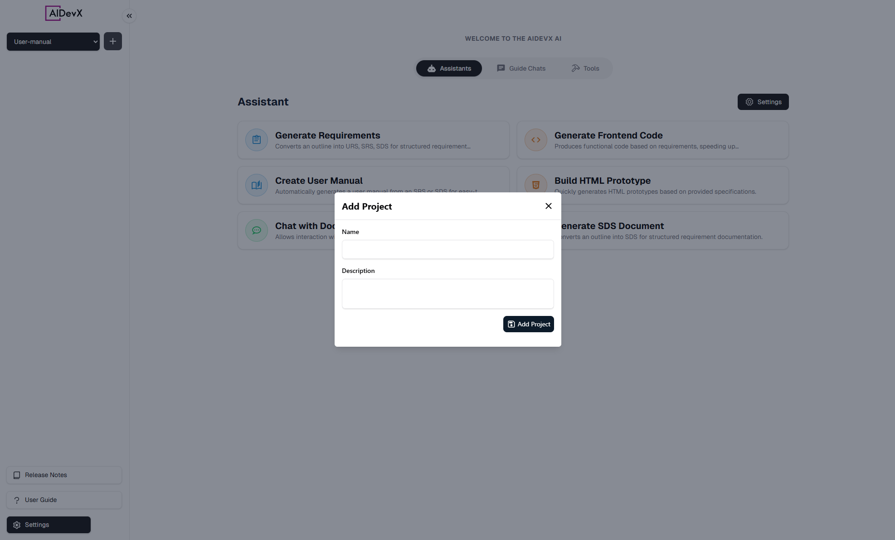
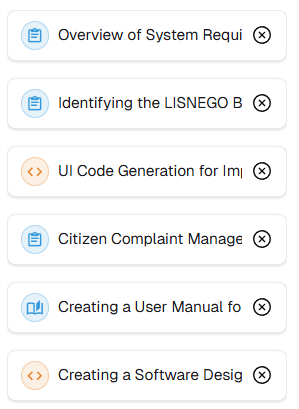
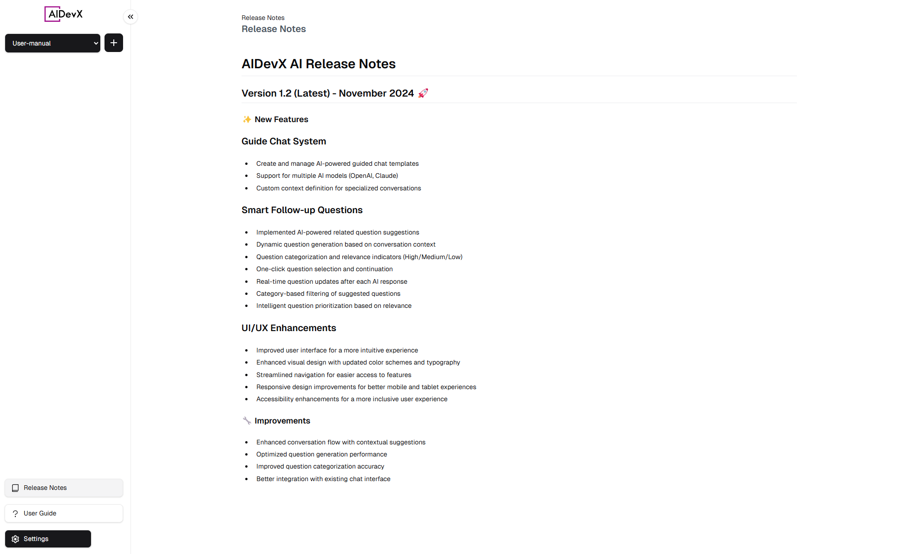
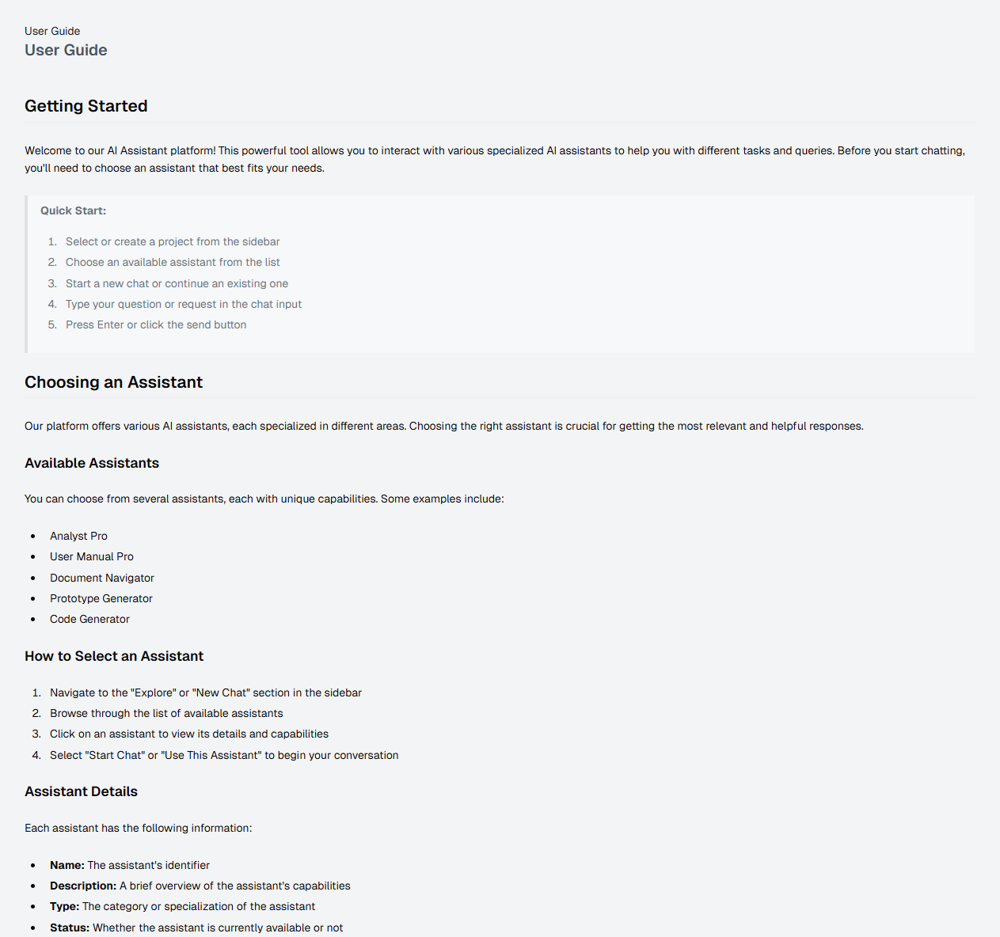

# Project Management

::: tip Overview
The Project Management interface provides a centralized way to organize your work, manage conversations, and access project features through the sidebar. Access the platform at [AIDevX Platform](https://aidevx.mtssb.io).
:::

## Interface Overview 🖥️

  

    <h4>📂 Project Selection</h4>
    <ul>
      <li>Switch between projects</li>
      <li>Create new projects</li>
      <li>Quick project access</li>
    </ul>
  

  

    <h4>💬 Conversations</h4>
    <ul>
      <li>View active chats</li>
      <li>Organize by type</li>
      <li>Recent conversations</li>
    </ul>
  

  

    <h4>📚 Documentation</h4>
    <ul>
      <li>Release notes</li>
      <li>User guides</li>
      <li>Feature documentation</li>
    </ul>
  

## Key Features

### 1. Project Selection 📂

#### Project Dropdown
- Use dropdown to switch projects
- Currently selected project highlighted
- Quick access to recent projects

#### Create New Project

Required fields:
1. Project Name
   - Unique identifier
   - Clear description
   - Used across platform

2. Project Description
   - Brief overview
   - Purpose and scope
   - Team context

### 2. Conversation Management 💬

#### Active Conversations
Organized by type:

1. **Requirements Documentation** 📋
   - System requirements
   - Analysis documents
   - Specifications

2. **Frontend Development** 💻
   - UI code generation
   - Component creation
   - Style implementation

3. **Documentation** 📖
   - User manuals
   - Guide creation
   - System documentation

4. **System Design** 🔧
   - Architecture planning
   - Design specifications
   - Technical diagrams

5. **Document Processing** 📄
   - Document analysis
   - Content management
   - File processing

### 3. Documentation Access 📚

#### Release Notes

Current information:
- Version details
- Latest updates
- New features
- Improvements

#### User Guide

Available sections:
- Getting started
- Platform features
- Configuration guides
- Best practices

## Best Practices 💡

::: tip For Best Results
- Keep conversations organized by type
- Use descriptive project names
- Update project descriptions regularly
- Close completed conversations
- Switch projects when changing context
:::

::: warning Important Notes
- Project names must be unique
- Changes affect all team members
- Save work before switching projects
- Review settings when creating projects
:::

 