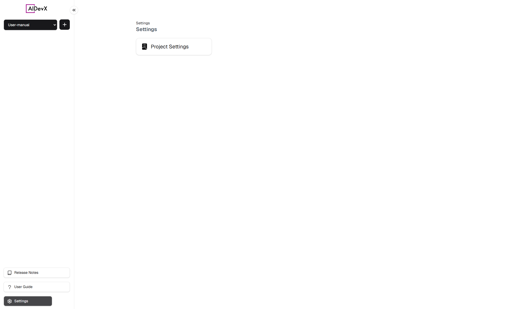
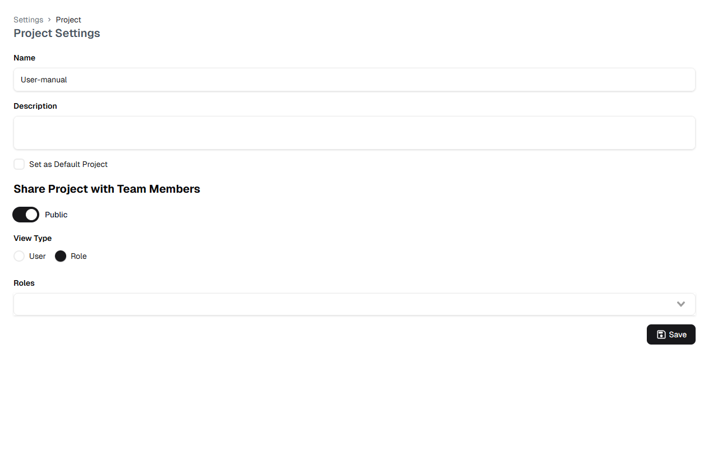

# Platform Settings

::: tip Overview
Configure your project settings, manage team access, and customize platform preferences.
:::

## Project Configuration

  

    <h4>📝 Basic Settings</h4>
    <ul>
      <li>Project name</li>
      <li>Project description</li>
      <li>Default project option</li>
    </ul>
  

  

    <h4>🔐 Access Control</h4>
    <ul>
      <li>Public/Private visibility</li>
      <li>User permissions</li>
      <li>Role management</li>
    </ul>
  

### Project Details

Required information:
1. **Project Name**
   - Unique identifier
   - Clear and descriptive
   - Used across platform

2. **Project Description**
   - Purpose and scope
   - Markdown supported
   - Team information

3. **Default Settings**
   - Set as default project
   - Auto-select on login
   - Quick access enabled

## Team Management

### Access Controls
1. **Visibility Settings**
   - Toggle public access
   - Control project visibility
   - Manage access levels

2. **Access Types**
   - User-based permissions
   - Role-based access
   - Team management

### Role Configuration
- Define team roles
- Set role permissions
- Assign team members

::: warning Important Notes
- Settings changes affect all members
- Review permissions carefully
- Default settings apply to all sessions
:::

## Navigation

You can access Settings through:
1. The sidebar Settings icon
2. The project dropdown menu
3. The quick access links in the navigation

For more information about project management, visit the [Project Management](./project-management.md) section. 