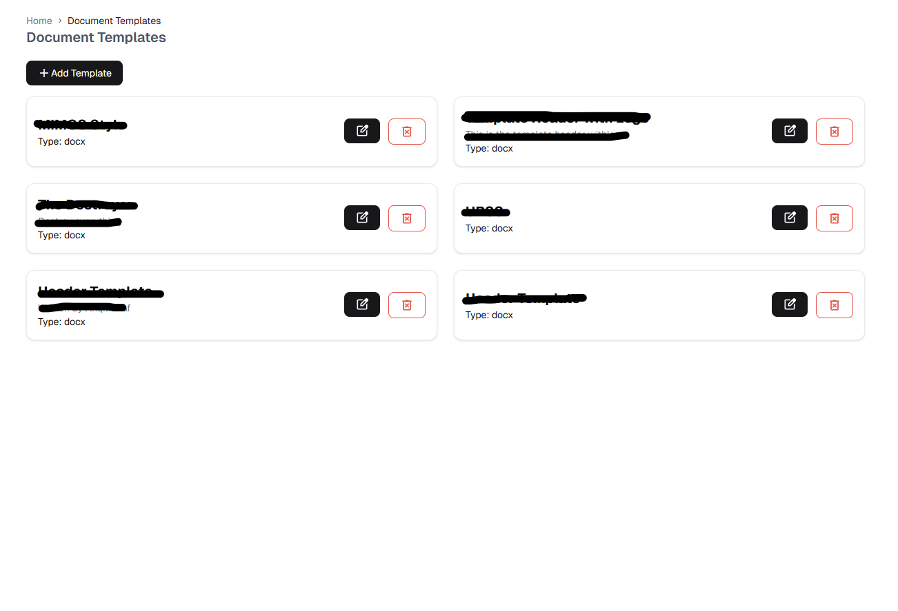
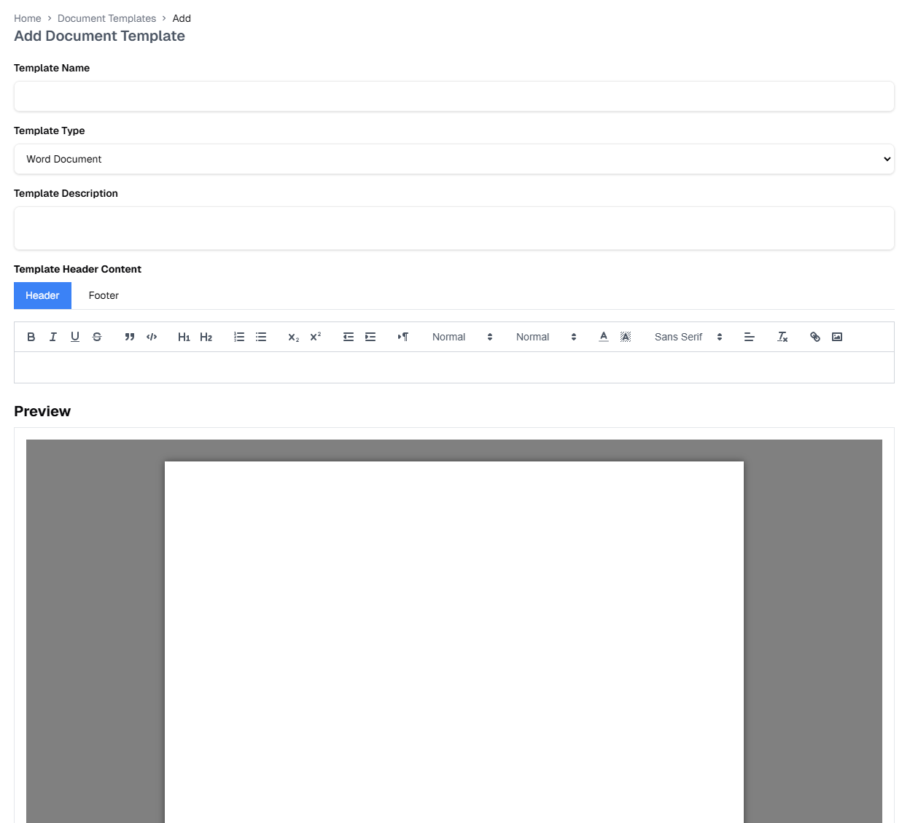
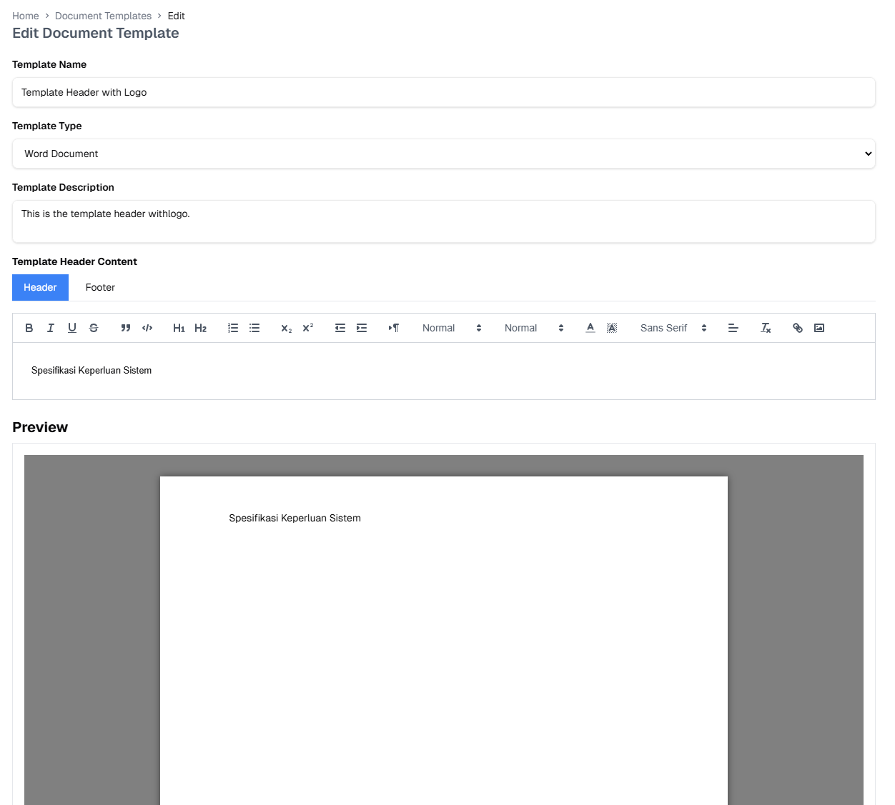

# Document Templates

::: tip Overview
Create and manage Word document templates with customizable formatting, headers, and footers.
:::

## Template Interface

### Main Features
1. **Template List**
   - View all available templates
   - Template status indicators
   - Quick action buttons

2. **Template Actions**
   - Create new template
   - Edit existing templates
   - Preview template
   - Delete template

## Template Management

### Creating Templates

Required fields:
- Template name
- Description
- Document type
- Base template (optional)

### Editing Templates

Editable elements:
- Header content
- Footer content
- Page formatting
- Document styles

## Template Usage

### Export with Template

Export steps:
1. Select document to export
2. Choose template from dropdown
3. Click "Export" to generate document

 