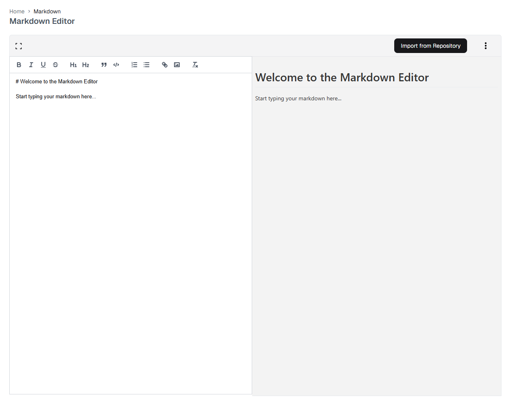
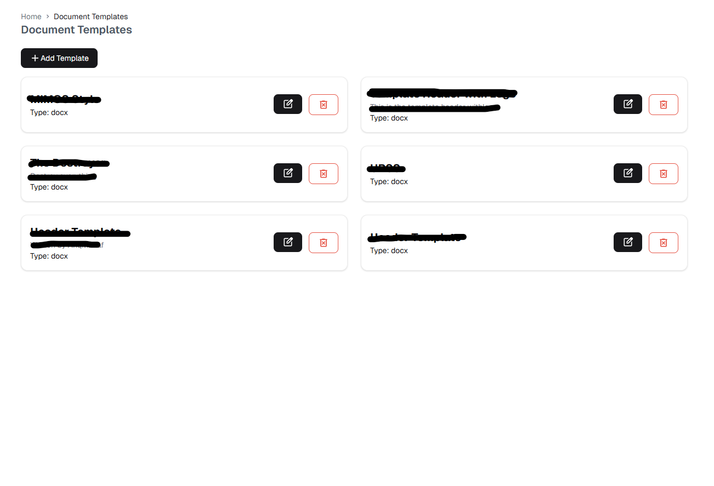
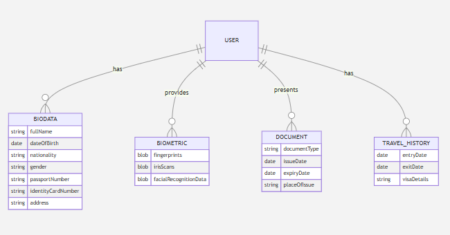
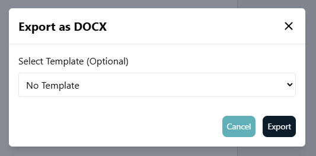

# Development Tools

::: tip Overview
Access our integrated development tools for document creation, diagramming, and content management.
:::

## Markdown Editor

### Key Features
- Split-view editing interface
- Real-time markdown preview
- Formatting toolbar with common options
- Document import/export capabilities

### Available Actions
- Create and edit markdown content
- Preview rendered output
- Export to different formats
- Import from repository

## Document Templates

### Template Features
- Word document (.docx) support
- Template management system
- Header and footer editing
- Document formatting options

### Template Actions
- Create new templates
- Edit existing templates
- Preview template changes
- Apply templates to documents

## Mermaid Diagrams

### Diagram Types
- Entity Relationship (ER) diagrams
- Flowcharts
- Sequence diagrams
- Class diagrams

### Diagram Features
- Real-time preview
- Syntax highlighting
- Export options
- Full-screen editing

## Export Options

Available formats:
- Markdown (.md)
- Word Document (.docx)

### Word Export

Export settings:
- Template selection
- Document formatting
- One-click export

## Full Screen Mode

Benefits:
- Maximized workspace
- Distraction-free editing
- Enhanced preview area
- Easy exit option

::: warning Important Notes
- Save your work regularly
- Preview before exporting
- Use appropriate templates for exports
- Check formatting in preview mode
:::

 