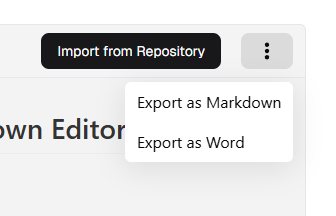
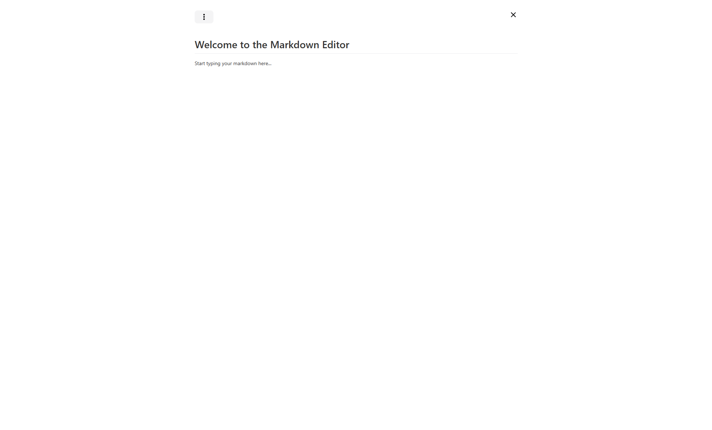

# Markdown Editor

::: tip Overview
Create and edit markdown documents with real-time preview, export options, and diagram support.
:::

## Interface Overview

### Main Components
1. **Editor Toolbar**
   - Text formatting (Bold, Italic)
   - Headings (H1-H6)
   - Lists (Bullet, Numbered)
   - Links and Images
   - Code blocks

2. **Split View**
   - Left: Markdown editor
   - Right: Live preview
   - Adjustable split

3. **Additional Controls**
   - Full-screen toggle
   - Export options (⋮)
   - Import from repository

## Document Management

### Import Options

Repository import features:
- Browse available documents
- Select document version
- Import directly to editor

### Export Menu

Available export formats:
- Markdown (.md)
- Word Document (.docx)

### Word Export

Export process:
1. Click export to Word
2. Select template (optional)
3. Click "Export" to save

## Editor Features

### Full Screen Mode

Full screen benefits:
- Maximum editing space
- Enhanced preview area
- Distraction-free writing
- Quick exit option

### Mermaid Diagrams

Supported diagram types:
- ER Diagrams
- Flowcharts
- Sequence diagrams
- Class diagrams

Example diagram code:

::: warning Important
- Save work regularly
- Preview before export
- Check diagram syntax
- Use appropriate templates
:::

 