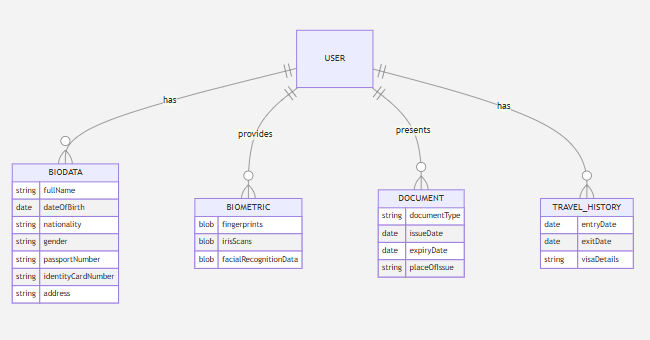
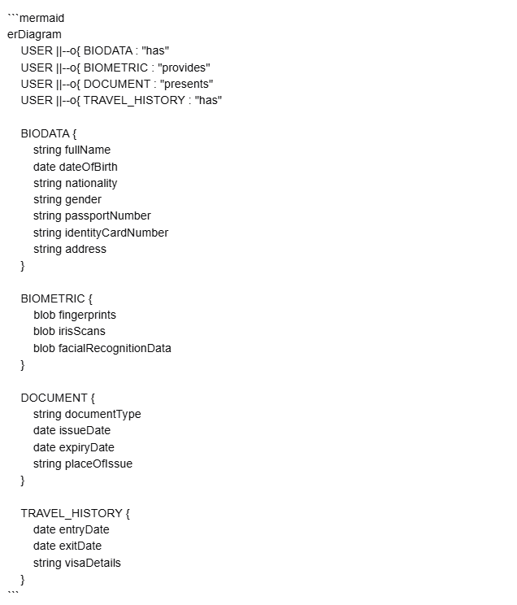
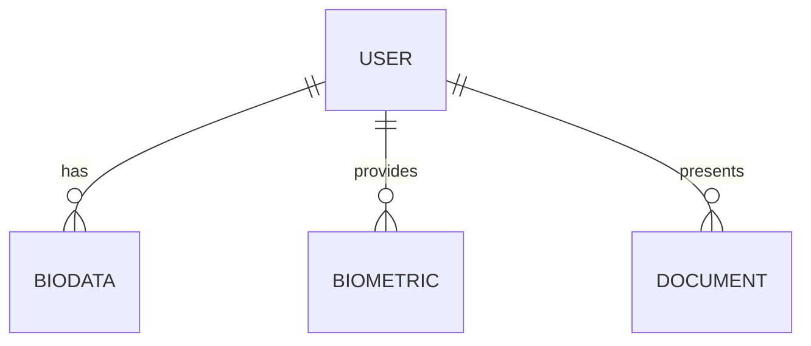

# Mermaid Diagrams

::: tip Overview
Create and preview diagrams directly in the markdown editor using Mermaid syntax.
:::

## Diagram Interface



### Editor Layout
1. **Code Section**
   - Write Mermaid syntax
   - Syntax highlighting
   - Real-time validation

2. **Preview Area**
   - Live diagram rendering
   - Auto-updates as you type
   - Visual error indicators

## Supported Diagrams

### Entity Relationship (ER)


Example syntax:


Features:
- Entity relationships
- Cardinality notation
- Relationship labels

### Other Diagram Types
Available diagram formats:
- Flowcharts
- Sequence diagrams
- Class diagrams

## Diagram Creation

### Writing Diagrams
1. Start with \```mermaid
2. Add diagram syntax
3. Preview updates automatically

### Editing Tools
- Full-screen mode for better visibility
- Syntax error highlighting
- Copy diagram as image
- Export options

## Best Practices

::: warning Important Notes
- Check syntax before saving
- Use proper indentation
- Keep diagrams simple and focused
- Test diagram rendering
:::

<style>
.feature-section {
  margin: 2rem 0;
  padding: 1rem;
  border: 1px solid #ddd;
  border-radius: 8px;
  background: #f8f9fa;
}

.feature-section img {
  width: 100%;
  max-width: 800px;
  border: 1px solid #ddd;
  border-radius: 4px;
  margin: 1rem 0;
}

.warning {
  background: #fff5f5;
  padding: 1rem;
  border-radius: 8px;
  margin: 1rem 0;
}

.code-block {
  background: #f8f9fa;
  padding: 1rem;
  border-radius: 4px;
  border: 1px solid #ddd;
  margin: 1rem 0;
}
</style> 