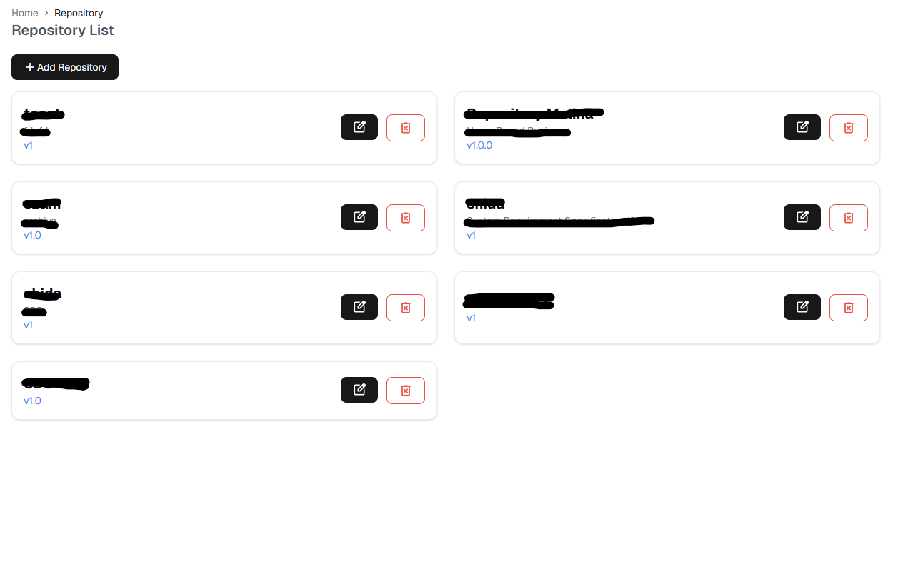
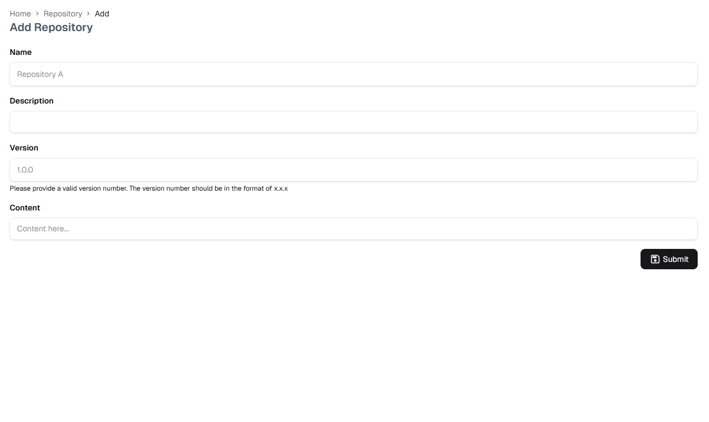
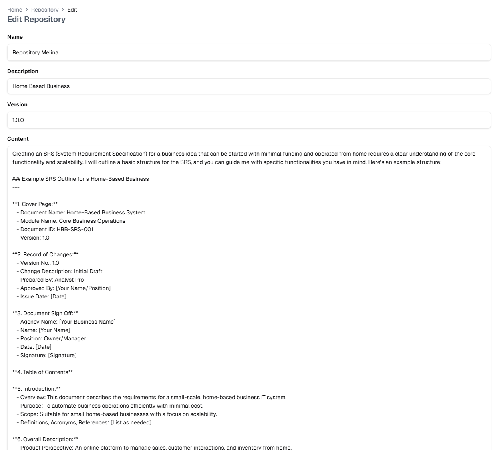
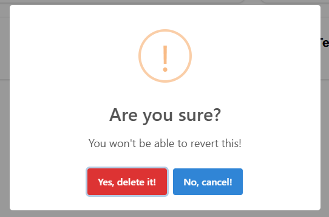

# Repository

The Repository feature allows you to store and manage various documents and their versions. This centralized storage system helps maintain document history and enables easy access across the platform.

## Repository List

The repository list displays all your stored documents with:
- Document name
- Version number (e.g., v1, v1.0.0)
- Actions:
  - Edit document
  - Delete document

## Adding to Repository

Click the "+ Add Repository" button to add a new document.

The Add Repository form includes:

1. **Name**
   - Enter a descriptive name for your document
   - Choose a clear, identifiable name

2. **Description**
   - Add details about the document's purpose
   - Include any relevant context or usage information

3. **Version**
   - Specify the version number (format: x.x.x)
   - Example: 1.0.0

4. **Content**
   - Enter or paste your document content
   - Supports markdown formatting

## Editing Documents

To edit a document:
1. Click the edit icon on the document card
2. Update the document details:
   - Name
   - Description
   - Version
   - Content
3. Preview changes before saving

::: tip Version Control
When editing documents:
- Update version numbers appropriately
- Use semantic versioning (MAJOR.MINOR.PATCH)
- Document significant changes
:::

## Deleting Documents

To delete a document:
1. Click the delete icon on the document card
2. Confirm deletion in the popup dialog
3. Note: This action cannot be reverted

::: warning Important
Before deleting:
- Ensure you have backups if needed
- Verify no other documents depend on this one
- Consider archiving instead of deleting
:::

For information about using repository documents in the Markdown Editor, visit the [Markdown Editor](./markdown-editor.md#importing-content) section. 