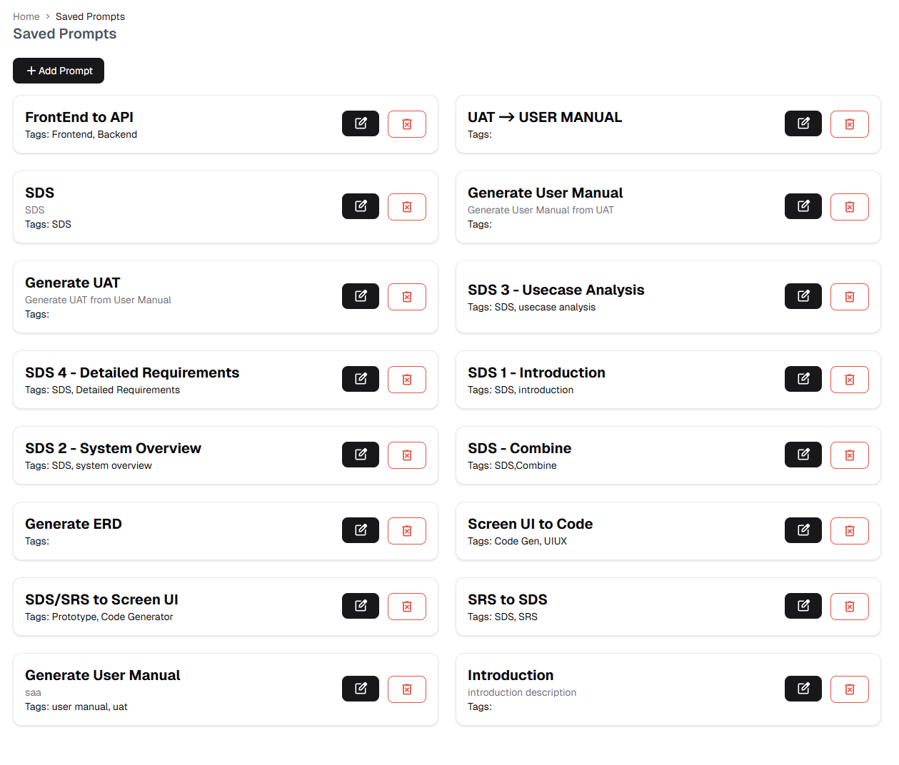
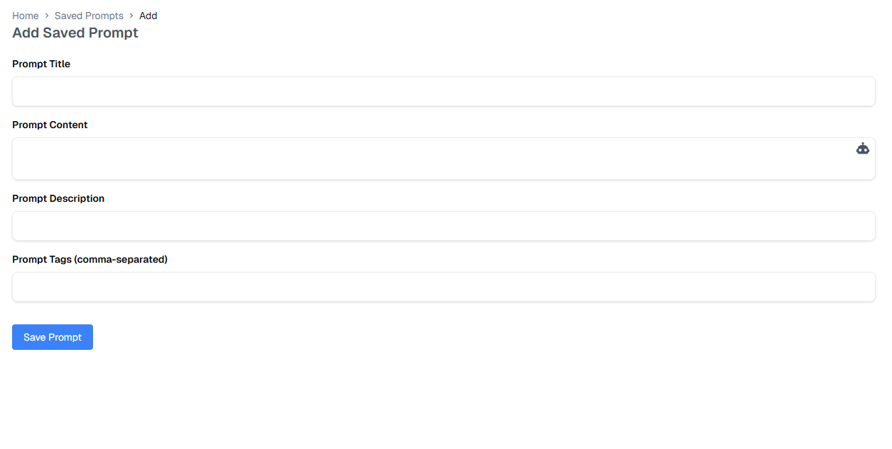
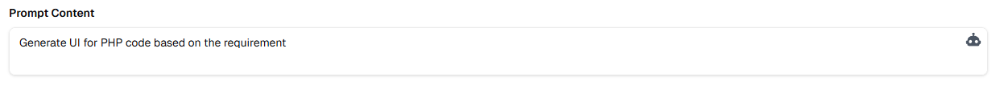
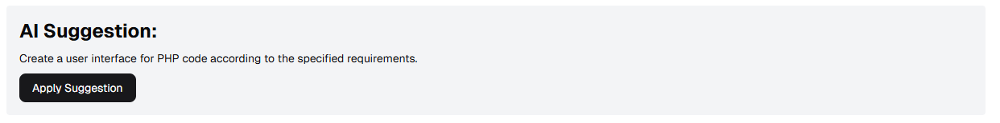
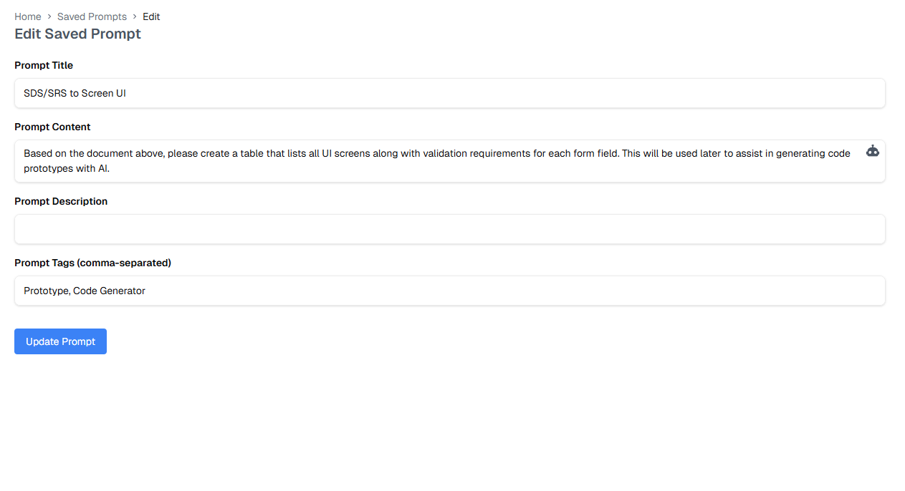

# Saved Prompts

The Saved Prompts feature allows you to store and manage frequently used prompts for AI interactions. This helps maintain consistency and saves time when working with similar tasks.

## Prompt List

The prompt list displays all your saved prompts with:
- Prompt title
- Associated tags (e.g., Frontend, Backend, SDS)
- Actions:
  - Edit prompt
  - Delete prompt

## Adding Prompts

Click the "+ Add Prompt" button to create a new prompt.

The Add Prompt form includes:

1. **Prompt Title**
   - Enter a descriptive name for your prompt
   - Choose a clear, identifiable title

2. **Prompt Content**
   - Enter the actual prompt text
   - Use clear and specific instructions

3. **Prompt Description**
   - Add details about the prompt's purpose
   - Include any relevant context or usage notes

4. **Prompt Tags**
   - Add comma-separated tags
   - Helps with organization and filtering

### AI Content Generation

When writing prompt content, you can get AI assistance:

1. Click the AI suggestion icon

2. The AI will analyze your input

3. Review the suggested content

4. Click "Apply Suggestion" to use the AI-generated content

## Editing Prompts

To edit a prompt:
1. Click the edit icon on the prompt card
2. Update the prompt details:
   - Title
   - Content
   - Description
   - Tags
3. Save your changes

::: tip Best Practices
- Use clear, descriptive titles
- Organize prompts with relevant tags
- Keep prompts focused on specific tasks
- Update prompts as your needs evolve
:::

::: warning Important
Before deleting prompts:
- Ensure they are no longer needed
- Check if other team members use them
- Consider archiving important prompts
:::

For information about using saved prompts in conversations, visit the [Project Management](../project-management.md) section. 